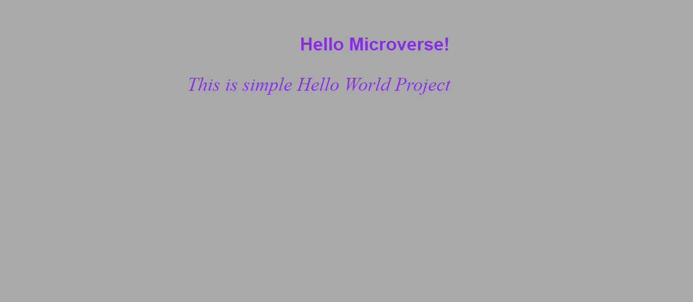

# Hello-World
This is simple Hello World Prject

## Built With

- Html,CSS
- Visual Studio Code
- 

Getting Started

**This is an example of how you may give instructions on setting up your project locally.**

To get a local copy up and running follow these simple example steps.

### Create Repository

### Clone in Git

### Add markup and css file

### Add commit and push

### Deployment